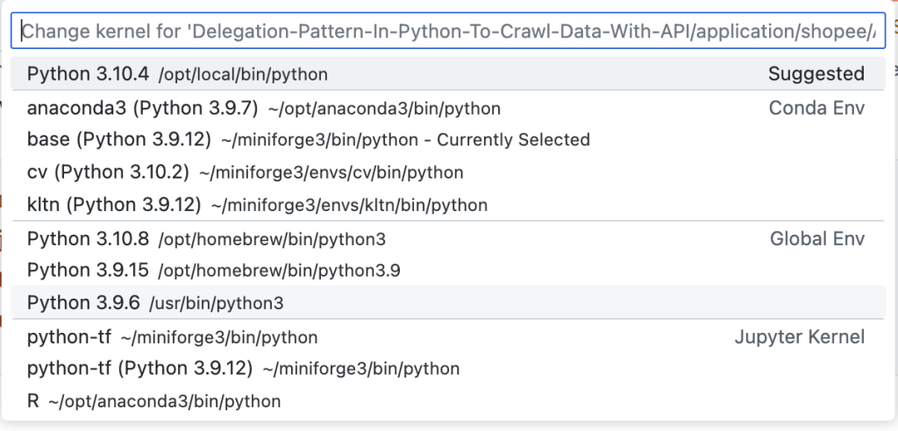
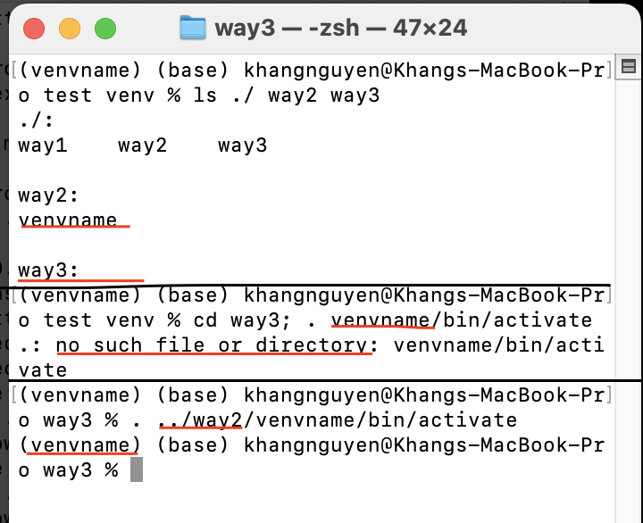
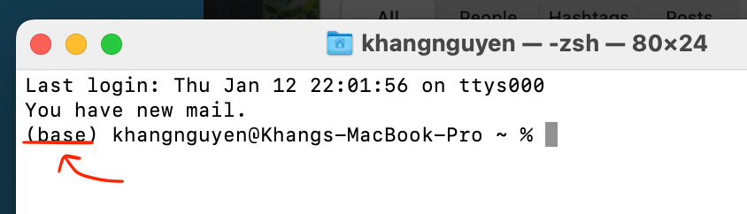

<svg xmlns="http://www.w3.org/2000/svg" fill="none" viewBox="0 0 24 24" strokeWidth={1.5} stroke="currentColor" className="w-6 h-6">
  <path strokeLinecap="round" strokeLinejoin="round" d="M11.25 11.25l.041-.02a.75.75 0 011.063.852l-.708 2.836a.75.75 0 001.063.853l.041-.021M21 12a9 9 0 11-18 0 9 9 0 0118 0zm-9-3.75h.008v.008H12V8.25z" />
</svg> Read this on [Nguyen Khang's blog](https://nguyenkhang.me/normal-ml-things/python-venv-things.html)

:::info venv
Virtual environment
:::

## I. Venv for a project

### 1. Creating a new venv

cd to the project folder and run this:

``shell
python3 -m venv venvname
```

or this (you will have to run `pip install virtualenv` first if you have not installed it yet)

``shell
virtualenv venvname
```

### 2. Activating a venv

``shell
. venvname/bin/activate
```

or

``shell
source venvname/bin/activate
```

### 3. Deactivating an active venv

``shell
cd venvname/bin/
$source deactivate
```

## II. Venv for projects

We could create a venv for multiple projects with the help of conda/miniforge:

### 1. list all conda discoverable environments

``shell
conda info --envs
```

If you're using VSCode or Jupyter Notebook, you could see a list of available environments like this:

  

### 2. Creating a new venv

``shell
conda create -n venvname python=x.y.z
```

x.y.z: python version, you could see a list of available python versions by using:

``shell
conda search "^python$"
```

### 3. Activating a venv

``shell
conda activate venvname
```

### 4. Install a new package

``shell
conda install <package>
```

For more information see:

``shell
conda install --h
```

### 5. Deactivating an active venv

``shell
conda deactivate
```

### 6. Deleting a venv

``shell
conda remove -n venvname --all
```

### A note

{ width="300", align=right }

:::note
Note that we could use venv for multiple projects like the way we set up in "[I. venv for a project](#i-venv-for-a-project)", and this is not smart because we have to remember venv's path, the venv will also not be included in VSCode or Jupyter Notebook's environment list.
:::

## III. Conda/miniforge's base environment

### 1. Add (base) to PATH

How to have a (base) before a command line like this?

  

1. After installation: cd to the bin folder, for example:

``shell
cd /opt/homebrew/Caskroom/miniforge/base/bin
```

2. Run init:

``shell
./conda init zsh
```

Exit and reopen the terminal.

### 2. Advanced for Mac users

`#!zsh ./conda init zsh` will automatically change the file ~/.zshrc, and help set the PATH environment variable for you.

You could check the file .zshrc before and after by using these commands:

``shell
cd ~
cat .zshrc
```
