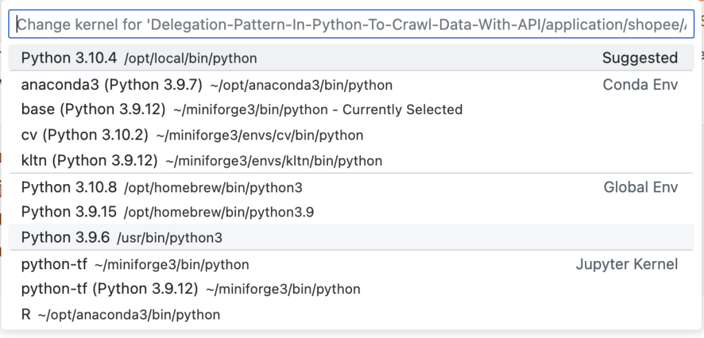

:material-information-outline:   Read this on [Nguyen Khang's blog](https://nguyenkhang.me/normal-ml-things/python-venv-things.html)

???+ info "venv"

    Virtual environment

## I. Venv for a project

### Creating a new venv

cd to the project folder and run this:

```zsh
python3 -m venv venvname
```

or this (you will have to run `pip install virtualenv` first if you have not installed it yet)

```zsh
virtualenv venvname
```

### Activating a venv

```zsh
. venvname/bin/activate
```

or

```zsh
source venvname/bin/activate
```

### Deactivating an active venv

```zsh
cd venvname/bin/
$source deactivate
```

## II. Venv for projects

We could create a venv for multiple projects with the help of conda/miniforge:

### 0. list all conda discoverable environments

```zsh
conda info --envs
```

If you're using VSCode or Jupyter Notebook, you could see a list of available environments like this:

  

### 1. Creating a new venv

```zsh
conda create -n venvname python=x.y.z
```

x.y.z: python version, you could see a list of available python versions by using:

```zsh
conda search "^python$"
```

### 2. Activating a venv

```zsh
conda activate venvname
```

### 3. Install a new package

```zsh
conda install <package>
```

For more information see:

```zsh
conda install --h
```

### 4. Deactivating an active venv

```zsh
conda deactivate
```

### 5. Deleting a venv

```zsh
conda remove -n venvname --all
```

### A note

{ width="300", align=right }

!!! note

    Note that we could use venv for multiple projects like the way we set up in "[I. venv for a project](#i-venv-for-a-project)", and this is not smart because we have to remember venv's path, the venv will also not be included in VSCode or Jupyter Notebook's environment list.

## III. Conda/miniforge's base environment

### 1. Add (base) to PATH

How to have a (base) before a command line like this?

  

1. After installation: cd to the bin folder, for example:

```zsh
cd /opt/homebrew/Caskroom/miniforge/base/bin
```

2. Run init:

```zsh
./conda init zsh
```

Exit and reopen the terminal.

### Advanced for Mac users

`#!zsh ./conda init zsh` will automatically change the file ~/.zshrc, and help set the PATH environment variable for you.

You could check the file .zshrc before and after by using these commands:

```zsh
cd ~
cat .zshrc
```